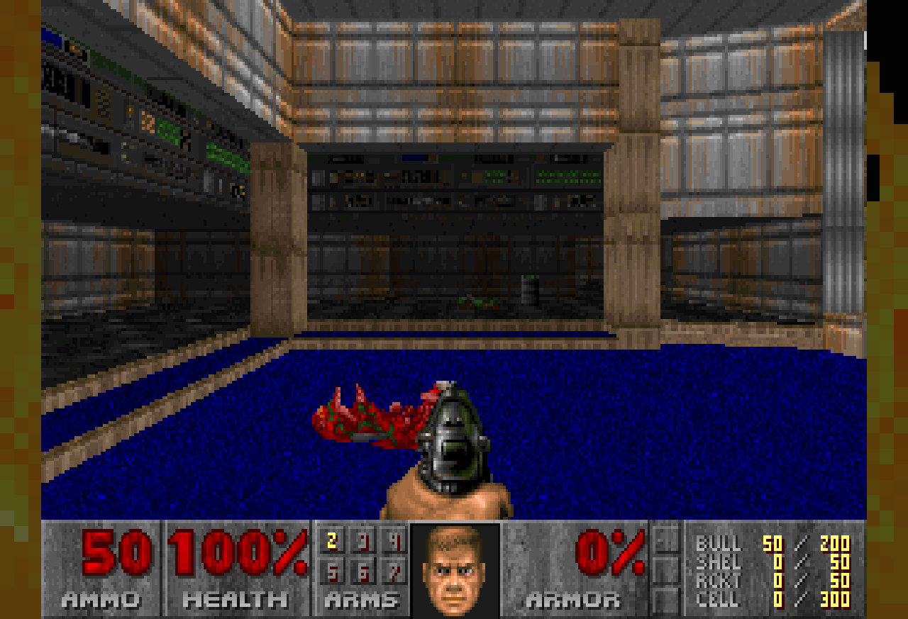

# webdoom

A slim, modern DOOM port for the browser, built directly from the
[id-Software/DOOM](https://github.com/id-Software/DOOM) `linuxdoom-1.10`
source. 348 KB of wasm, zero client install, zero-config multiplayer.

- Runs in stock Chrome / Edge / Firefox (WASM + WebGL2 + WebAudio)
- Uncapped framerate with 35 Hz-exact game logic (Crispy-style
  interpolation; "vanilla mode" toggle under OPTIONS on the launcher menu)
- Modern controls: pointer-lock mouse, WASD, rebindable keys, analog
  twin-stick gamepad — Doom 1+2 re-release defaults
- Authentic audio: DMX PCM sfx via WebAudio, music through an emulated
  OPL2 (Nuked OPL3) playing the IWAD's own GENMIDI bank
- 1–4 players: instant single player; arcade lobby for network play
  (join order = color: Green/Indigo/Brown/Red — nothing to type)
- PSX DOOM fire background on the launcher — chunky indexed-cell fire on
  a 64×40 grid, palette-matched, flares on every menu transition;
  measured < 1 ms/tick on the weakest network host
- Deterministic-lockstep netcode over a server tic relay (see
  [docs/netcode.md](docs/netcode.md)); verified by a headless harness
  that compares per-tic gamestate hashes across real clients
- Server carries the WAD library (Ultimate Doom, Doom II, Final Doom,
  SIGIL, Master Levels, NRFTL, Chex Quest); clients cache by
  content hash via a service worker — the second load is served from that
  cache, and single player works offline



*Ultimate Doom E1M1, captured from a headless Chrome by `browser-sp`. The
framebuffer is DOOM's own 320×200, scaled 4:3 with nearest-neighbour — a
widescreen mode existed between 2026-07 and 2026-09 and was removed; see
spec.md §"Widescreen view — REVERSED".*

Contributing: [CONTRIBUTING.md](CONTRIBUTING.md) — the tic-identity rule
is the one that will bite. Security model, and what is deliberately not
defended: [SECURITY.md](SECURITY.md).

## Quick start

```sh
WAD_SRC=host:~/doom-wads tools/fetch-wads.sh   # pull your WAD library, build manifest
source tools/emsdk-env.sh    # pinned emcc on PATH
make -C engine               # → build/doom.js + doom.wasm
(cd server && npm i)
./start.sh                   # http://<host>:8666/
```

LAN players (or tailnet peers) just open the URL. First player into the
Multiplayer panel is Green, second Indigo, then Brown, Red. Anyone picks
the game/map/skill/mode; anyone hits START; 3-2-1, everyone's in.

`webdoom.service` is a ready systemd unit.

## Layout

| Path      | What |
|-----------|------|
| `engine/core/` | linuxdoom-1.10, vendored pristine in commit 1, patched in reviewable commits |
| `engine/web/`  | web platform layer: video/audio/input/net + MUS→OPL sequencer |
| `client/`      | vanilla-JS shell: lobby, WebGL2 renderer, input, audio, service worker |
| `server/`      | Node ≥ 20, single process, single port; only dep `ws` |
| `tools/`       | emsdk pin, WAD fetch/identify, test suites, bench harness, native sanitizer target |
| `docs/`        | 32 documents — **[the index](docs/README.md)** lists every one. The ones most people want: [netcode](docs/netcode.md), [renderer](docs/renderer.md), [playsim](docs/playsim.md), [formats](docs/formats.md), [bare-metal](docs/bare-metal.md), [perf](docs/perf.md), [state-machine](docs/state-machine.md), [engine-archaeology](docs/engine-archaeology.md) |

## Tests

```sh
tools/run-tests.sh            # everything: 88 legs, ~13 min without the N64 leg (~20 with it; the runner prints its time)
tools/run-tests.sh --quick    # no WADs, no build, no browser — what CI runs
tools/run-tests.sh --list     # the leg registry
```

Each leg is isolated: one red does not hide the rest, and the run ends with a
table naming every leg, its verdict and the count it reported about itself. A
leg whose prerequisites are absent is a SKIP **with its reason**, counted in
that table, and `--require-complete` turns any skip into a failure.

**What CI covers.** Game data is not distributable, so the GitHub runner has no
IWADs and runs the `--quick` tier — lint, the doc-drift gate, the state-machine
and precache checks, the gate census, and the three fuzz suites. Everything that
needs a WAD, a built engine or a browser (the sim and render goldens, netplay,
the ASan and cross-architecture legs, the 19 browser legs) runs locally and says
so. The workflow prints the list it did not cover.

Three legs deserve a sentence the registry cannot give them:

- **sim goldens**: all 13 built-in IWAD demos replay headless with per-tic
  gamestate fingerprints pinned against golden traces, cross-validated
  tic-for-tic against an instrumented Chocolate Doom (44,580 tics;
  `tools/build-choco-reference.sh`, then `node tools/demo-test.mjs --cross <binary>`).
- **render goldens**: per-tic framebuffer hashes over the same 13 demos, so a
  renderer change that moves a pixel fails at the exact tic.
- **cross-architecture**: the freestanding core replays the same goldens on
  32-bit ARM under qemu and on an emulated Nintendo 64, bit-identical.

## License

GPL-2.0-or-later (the id Software source re-license; Nuked OPL3 is
GPL-2). Game data (WADs) is not distributed with this repository.
