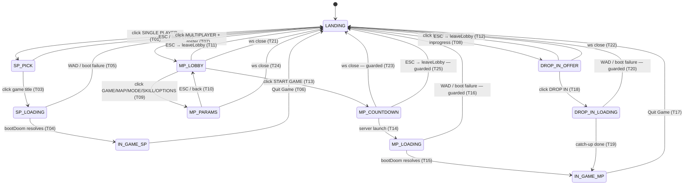

# webdoom JS lobby state machine

JS-layer only. The wasm engine's `m_menu.c` is a separate concern;
this doc covers the `client/js/lobby.js` + `menu.js` + `countdown.js`
state machine that controls what the browser shows from page-load through
in-game.

---

## State encoding

State is not a single variable — it is read from the combination of four
module-scope values in `lobby.js` plus two UI objects:

| variable / object | what it encodes |
|-------------------|-----------------|
| `booted` (boolean) | false = launcher side; true = engine is running |
| `lobby` (null \| ws api) | null = no multiplayer WebSocket |
| `roster` (null \| msg) | latest `roster` message (pre-game lobby data) |
| `ipSummary` (null \| msg) | latest `inprogress` summary (live game; drop-in path) |
| `menu.current()?.id` + `menu.depth()` | which screen the menu stack shows |
| `#countdown` hidden state | whether the countdown overlay is visible |

---

## States

| # | State | `booted` | `lobby` | `roster` | `ipSummary` | menu screen | countdown |
|---|-------|----------|---------|----------|-------------|-------------|-----------|
| 1 | **LANDING** | false | null | null | null | root (depth 1) | hidden |
| 2 | **SP-PICK** | false | null | null | null | sp-game-pick (depth ≥ 2) | hidden |
| 3 | **SP-LOADING** | false | null | null | null | hidden (loading panel) | hidden |
| 4 | **IN-GAME-SP** | true | null | null | null | hidden | hidden |
| 5 | **MP-LOBBY** | false | live | set | null | id='lobby' (depth ≥ 2) | hidden |
| 6 | **MP-PARAMS** | false | live | set | null | picker screen (depth ≥ 3) | hidden |
| 7 | **MP-COUNTDOWN** | false | live | set | null | visible (lobby still shown) | visible |
| 8 | **MP-LOADING** | true* | live | set | null | hidden | visible (GO) / hidden |
| 9 | **IN-GAME-MP** | true | live | null | null | hidden | hidden |
| 10 | **DROP-IN-OFFER** | false | live | null | set | id='inprogress' | hidden |
| 11 | **DROP-IN-LOADING** | true* | live | null | set | hidden | hidden |

\* `booted` is set to `true` in the `launch` event handler before `bootDoom()` is called.

---

## Transitions

### User-action transitions

| ID | From | To | Trigger |
|----|------|----|---------|
| T01 | LANDING | SP-PICK | click SINGLE PLAYER |
| T02 | SP-PICK | LANDING | ESC / back (stack pop) |
| T03 | SP-PICK | SP-LOADING | click a game title → `bootDoom()` starts |
| T06 | IN-GAME-SP | LANDING | Quit Game → Y → `onQuit` → `returnToMenu()` |
| T07 | LANDING | MP-LOBBY | click MULTIPLAYER (ws connects; roster arrives) |
| T08 | LANDING | DROP-IN-OFFER | click MULTIPLAYER while a game is live (inprogress arrives) |
| T09 | MP-LOBBY | MP-PARAMS | click GAME / MAP / MODE / SKILL / OPTIONS |
| T10 | MP-PARAMS | MP-LOBBY | ESC / back from picker |
| T11 | MP-LOBBY | LANDING | ESC / back on lobby → `leaveLobby()` |
| T12 | DROP-IN-OFFER | LANDING | ESC / back on inprogress → `leaveLobby()` |
| T13 | MP-LOBBY | MP-COUNTDOWN | click START GAME → server sends `countdown` 3/2/1 |
| T17 | IN-GAME-MP | LANDING | Quit Game → Y → `onQuit` → `returnToMenu()` |
| T18 | DROP-IN-OFFER | DROP-IN-LOADING | click DROP IN → `lobby.send({t:'join'…})` → server welcome+launch |

### Server-event transitions

| ID | From | To | Server message |
|----|------|----|----------------|
| T04 | SP-LOADING | IN-GAME-SP | `bootDoom()` resolves |
| T14 | MP-COUNTDOWN | MP-LOADING | server `launch` → `menu.hide()` + `bootDoom()` starts |
| T15 | MP-LOADING | IN-GAME-MP | `bootDoom()` resolves |
| T19 | DROP-IN-LOADING | IN-GAME-MP | catch-up done, relay goes live |

### Failure transitions

| ID | From | To | Failure event |
|----|------|----|---------------|
| T05 | SP-LOADING | LANDING | `bootDoom()` rejects (WAD fetch / engine fail) |
| T16 | MP-LOADING | LANDING | `bootDoom()` rejects — **guard added** (see below) |
| T20 | DROP-IN-LOADING | LANDING | `bootDoom()` rejects — **guard added** (same catch) |
| T21 | MP-LOBBY | LANDING | WebSocket `close` event (unexpected) |
| T22 | DROP-IN-OFFER | LANDING | WebSocket `close` event (unexpected) |
| T23 | MP-COUNTDOWN | LANDING | WebSocket `close` event mid-countdown — **guard added** |
| T24 | MP-PARAMS | LANDING | WebSocket `close` event while picker is open |
| T25 | MP-COUNTDOWN | LANDING | ESC → `menu.back()` → `lobbyScreen.onBack` → `leaveLobby()` — **guard added** |

---

## Impossible-state analysis

| Impossible state | Can it be represented? | Prevented by? |
|-----------------|----------------------|---------------|
| **Countdown visible after ESC mid-countdown** — user presses ESC during 3/2/1, `leaveLobby()` runs, but countdown overlay stays because `lobby` is nulled before the async `close` event, so the `closed` handler's T23 guard `if (!lobby) return` fires first | YES — `countdown.show()` was called and `leaveLobby()` previously had no `countdown.reset()` call | **BUG (now fixed)**: `leaveLobby()` now calls `countdown.reset()` directly (T25 guard). *Lesson: the T23 guard in the `closed` handler is bypassed by the deliberate-leave early-return; guarding must also sit in the synchronous exit path.* |
| **Countdown visible with no lobby (unexpected ws close)** — countdown overlay showing after ws disconnects mid-countdown | YES — same `countdown.show()` left active | **BUG (now fixed)**: `closed` handler calls `countdown.reset()` (T23 guard). |
| **`booted=true` after MP WAD / engine failure** — engine flag stuck, menu hidden, user cannot retry | YES — `booted` is set before `bootDoom()`; the MP `.catch()` only called `status()`, not a reset | **BUG (now fixed)**: MP launch `.catch()` now resets `booted=false`, calls `countdown.reset()`, `menu.show()`, `menu.reset(rootScreen())`, closes lobby (T16/T20 guard). The SP path already had this fix (3.4). |
| **Two lobby screens on the menu stack** (roster + inprogress simultaneously) | Theoretically possible if both `roster` and `inprogress` events arrived | NOT reachable: the server sends exactly one of `roster` (no active session) or `inprogress` (session live) at connect time. `enterMultiplayer()` also checks `ipSummary` vs `roster` before pushing the screen. |
| **START enabled with zero players** | YES as a UI affordance — START GAME row is always shown | Server-side guard: `if (m.t === 'start' && lobby.size >= 1) startGame()`. Client never guards it; server does. |
| **DROP IN clickable while already booted** | Would re-enter `bootDoom()` with `booted=true` | `dropIn()` has an explicit guard: `if (booted \|\| ipSlot < 0) return`. |
| **Double launch** — `launch` event processed when `booted` is already `true` | YES if ws delivers a duplicate launch frame | Launch handler guards: `if (booted) return`. |
| **Params changed mid-countdown** — lobby picker still accessible while countdown ticks | YES — the lobby screen is not hidden during countdown; pickers can be opened | Server drops all `params` messages once `startGame()` runs: `if (session) return`. No client guard needed. |
| **Stale roster after ws close** | Would show wrong player list if `roster` not cleared | `closed` handler sets `roster = null`; `leaveLobby()` does too. |
| **`inprogress` event updating menu while in-game** | Server could theoretically push `inprogress` to a booted client | Harmless: `menu` is already hidden; the only effect is updating `ipSummary` in memory. No user-visible issue. |

---

## Mermaid state diagram

---

## Edge → test coverage

| Edge ID | Transition | Test | File |
|---------|-----------|------|------|
| T01 | LANDING → SP-PICK | `lobby-menu-nav` | browser-lobby-test.mjs |
| T02 | SP-PICK → LANDING | `lobby-menu-nav` | browser-lobby-test.mjs |
| T03 | SP-PICK → SP-LOADING | `sp-boot` | browser-test.mjs (existing) |
| T04 | SP-LOADING → IN-GAME-SP | `sp-boot` | browser-test.mjs (existing) |
| T05 | SP-LOADING → LANDING (WAD fail) | `1-wad-fetch-failure` | browser-resilience-test.mjs (existing) |
| T06 | IN-GAME-SP → LANDING | `sp-quit` | browser-lobby-test.mjs |
| T07 | LANDING → MP-LOBBY | `lobby-menu-nav` | browser-lobby-test.mjs |
| T08 | LANDING → DROP-IN-OFFER | `drop-in-offer-esc` | browser-lobby-test.mjs |
| T09 | MP-LOBBY → MP-PARAMS | `lobby-menu-nav` | browser-lobby-test.mjs |
| T10 | MP-PARAMS → MP-LOBBY | `lobby-menu-nav` | browser-lobby-test.mjs |
| T11 | MP-LOBBY → LANDING (ESC) | `lobby-menu-nav` | browser-lobby-test.mjs |
| T12 | DROP-IN-OFFER → LANDING (ESC) | `drop-in-offer-esc` | browser-lobby-test.mjs |
| T13 | MP-LOBBY → MP-COUNTDOWN | `mp-countdown-ws-close` | browser-lobby-test.mjs |
| T14 | MP-COUNTDOWN → MP-LOADING | `mp-launch-flow` | browser-net-test.mjs (existing) |
| T15 | MP-LOADING → IN-GAME-MP | `mp-launch-flow` | browser-net-test.mjs (existing) |
| T16 | MP-LOADING → LANDING (WAD fail) | `mp-launch-wad-fail` | browser-lobby-test.mjs |
| T17 | IN-GAME-MP → LANDING | `mp-launch-flow` | browser-net-test.mjs (existing) |
| T18 | DROP-IN-OFFER → DROP-IN-LOADING | `drop-in-full` | browser-join-test.mjs (existing) |
| T19 | DROP-IN-LOADING → IN-GAME-MP | `drop-in-full` | browser-join-test.mjs (existing) |
| T20 | DROP-IN-LOADING → LANDING (WAD fail) | `mp-launch-wad-fail` (same catch path as T16; drop-in entry point not independently driven — identical catch block) | browser-lobby-test.mjs |
| T21 | MP-LOBBY → LANDING (ws close) | `mp-lobby-ws-close` | browser-lobby-test.mjs |
| T22 | DROP-IN-OFFER → LANDING (ws close) | `drop-in-offer-ws-close` | browser-lobby-test.mjs |
| T23 | MP-COUNTDOWN → LANDING (ws close) | `mp-countdown-ws-close` | browser-lobby-test.mjs |
| T24 | MP-PARAMS → LANDING (ws close) | `mp-lobby-ws-close` | browser-lobby-test.mjs |
| T25 | MP-COUNTDOWN → LANDING (ESC) | `mp-countdown-esc` | browser-lobby-test.mjs |

Coverage: **25 / 25 edges** covered.

---

## Boundary note

The engine's `m_menu.c` is wasm, driven by the game loop. It handles the
in-game menus (New Game, Options, Load/Save, Quit). That state machine is
not in scope here. The boundary is `bootDoom()` returning: after that call
resolves, `m_menu.c` is live and the JS lobby layer steps back (menu
hidden, lobby WS stays open for tic relay). `returnToMenu()` / `onQuit`
are the only callbacks crossing the boundary back from engine to JS.
